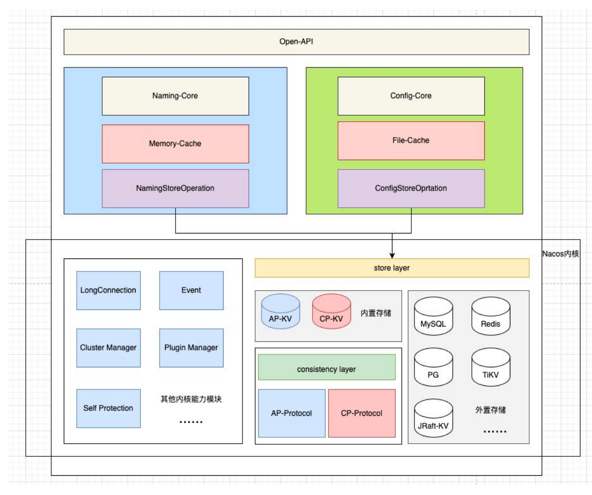

## Nacos 源码解析

### 服务端管理 

ServerMemberManager 管理Nacos集群Server


### 服务注册
基于Nacos 2.0.4最新跨度较大的版本, 源码中还是保留了以往的版本v1, 做版本兼容 需要注意.

(ephemeral=true)NamingGrpcClientProxy -> RpcClient 长连接、InstanceRequest -> NacosServer -> GrpcBiStreamRequestAcceptor(接收长连接)/GrpcRequestAcceptor(处理请求) 
    -> InstanceRequestHandler(实例注册/注销请求处理)  

(ephemeral=false) NamingHttpClientProxy -> HTTP请求接口 /v1/ns/instance -> InstanceController
#### AP 方式的注册服务(默认)
`InstanceController` 对于服务实例相关的Web Restful风格接口提供, 基于Spring MVC实现, 那么直接找到服务注册的方法
```
@PostMapping
public String register(HttpServletRequest request) throws Exception {
    // ...省略从Request中获取参数
    getInstanceOperator().registerInstance(namespaceId, serviceName, instance);
}
```
最终通过`InstanceOperatorClientImpl.registerInstance()` 

`2.0`之后的Grpc方式. 

1. `GrpcRequestAcceptor` 类似MVC的`DispatchServlet`, 找到对应请求的处理器(并且会更新客户端最后活跃时间, 服务端会定期检测所有客户端-健康检测/剔除 `ConnectionManager`.).
2. `InstanceRequestHandler` 负责处理实例注册/注销的处理器
3. 构建服务实例基础实体 Service = namespace + groupName + ServiceName, 构成一个服务的唯一实体.
4. 根据clientId(2.0这里实际是连接id).获取client, 存储这个客户端实体本次的服务发布信息. 
5. 发布`ClientEvent.ClientChangedEvent`, 通过`DistroProtocol`协议异步同步到集群其他节点(`DistroClientDataProcessor`)
6. 发布`ClientOperationEvent.ClientRegisterServiceEvent`, 通过`ClientServiceIndexesManager` 维护一个索引项. `k = Service,v = Set<String> clientIds`. 通过这个索引可以找到一个服务下的所有实例(长连接的client).

可以发现很多操作都是通过发布事件放入内存队列去异步执行的.
#### CP 方式的注册服务
`PersistentConsistencyServiceDelegateImpl` 1.4.0以下版本只能基于JRaft算法,
而高版本已经下沉CP的实现到内核将计算和存储分离,更通用和扩展, 可以接入DB或Redis实现持久化

#### Distro协议同步节点数据
1. `DistroProtocol` Distro协议实现
   1. `DistroVerifyTimedTask` 定时每隔五秒向集群其他节点发送快照数据作校验
   2. `DistroLoadDataTask` 初始启动向集群节点拉取一次全量数据
2. `DistroComponentHolder` Distro 基本组件的持有类, V2和V1都是通过一个注册器类往这个类设置对应版本的组件
   1. v1 `DistroHttpRegistry`
   2. v2 `DistroClientComponentRegistry`
3. `DistroTaskEngineHolder` Distro (异步)任务引擎
4. `DistroClientDataProcessor` Distro 数据处理器，ADD/CHANGE/UPDATE

0100 << 1 = 1000 
这里直接采用hash & oldCap的方式. 
1. 如果 == 0 说明原hash值是不含有原oldCap的进制位的, 例如`1000`、`1010`、`1011`, 而因为其掩码机制, 实际上后续的最高位都会被掩码. 那么实际有效的值只会包含在原oldCap - 1的范围内, 因此这个元素也就不需要迁移
2. 而对于 == 1的情况下. 原hash值含有原oldCap的进制位. `1100`、`1101`、`1111`、`0100`,此类因为其原oldCap - 1的掩码下. 掩盖了最高位, 但是由于扩容机制容量左移了一位, 那么 == 1的该位就会参与计算(该位换算也就是oldCap), 也就是需要迁移的curIndex + oldCap 


## 实例健康检测

### ephemeral 实例
1. ClientBeatProcessorV2 处理客户端主动发起的心跳(2.x 版本基于长连接，目前发现这里入口是Controller.)
2. ClientBeatCheckTaskV2 client检测 
   1. `UnhealthyInstanceChecker` 不健康实例标记, 心跳超时 x 秒后实例就会被标识为不健康.(默认 15秒)
   2. `ExpiredInstanceChecker` 心跳超时过长的实例剔除(默认 30秒)
### persistent 实例
    对于持久化实例, 客户端是不会主动发起心跳, Nacos提供了三种探活方式探测持久化实例的健康
1. HttpHealthCheckProcessor
2. MysqlHealthCheckProcessor
3. TcpHealthCheckProcessor

### 2.x 基于TCP长连接
`ConnectionBasedClientManager.ExpiredClientCleaner` 默认(3 分钟)
`ConnectionManager`.start() 定时探测连接
1. 是否对某些IP连接做连接数限制
2. 连接保活超时判定（20秒）
3. 总连接是否超限，超过限制优先对SDK客户端剔除（发起连接重置请求，由客户端去找集群中的其他成员）
4. 对连接保活超时的客户端进行主动健康检测, 未通过的关闭连接。


## 为什么Nacos支持AP和CP

Nacos是集注册中心和配置中心为一体的中间件

对于注册中心而言, 是十分重要的组件，服务之间感知对方服务的当前可正常提供服务的实例信息，
必须从服务发现注册中心进行获取, 所以对于注册中心的设计更侧重于可用性,对于数据丢失可以通过定时校验解决,
故采用自研的Distro 最终一致性协议(基于 Gossip 和 Eureka)

而对于配置中心而言, 是直接在 Nacos 服务端进行创建并进行管理的，必须保证大部分的节点都保存了此配
置数据才能认为配置被成功保存，故采用自研基于Raft的JRaft


